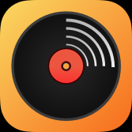
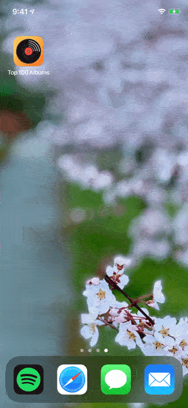
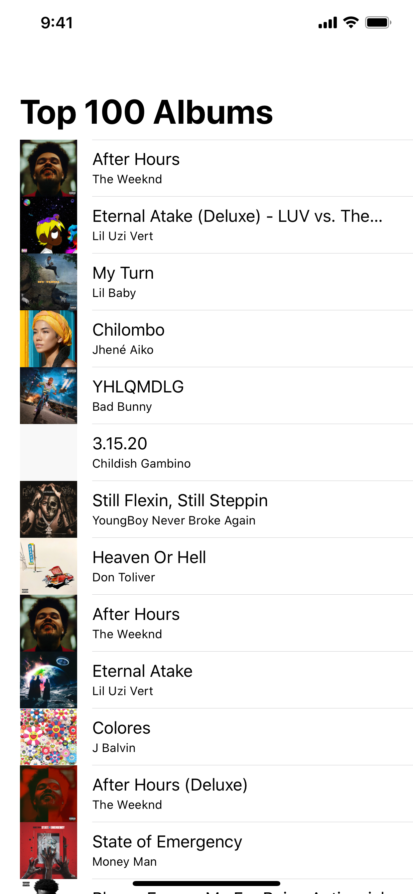
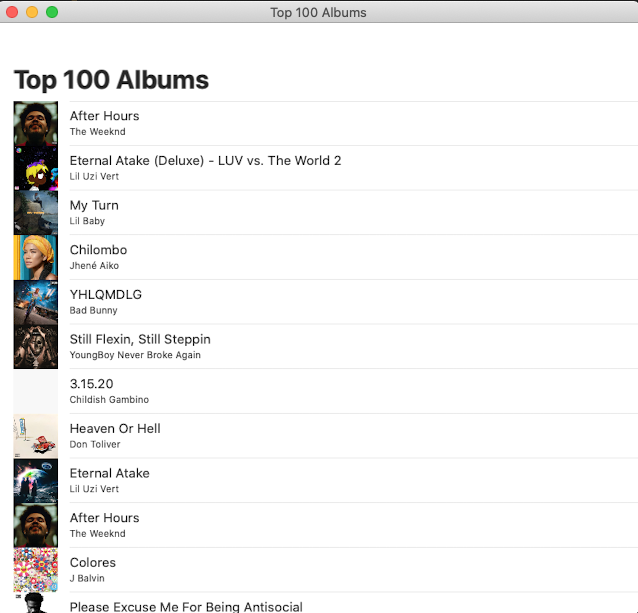

# iTunes Top Album Viewer

    

    
    
    

This is a simple app to view the top 100 albums and open them in the Music app.

## Walkthrough

## Features

- [x] Browse the top 100 albums across all generes on iTunes

- [x] Open album in iTunes

- [ ] Add Error Handling

## Screenshots

### iOS

    <source srcset="Images/iPhone_Dark.png" media="(prefers-color-scheme: dark)">
    

### macOS

    <source srcset="Images/macOS_Dark.png" media="(prefers-color-scheme: dark)">
    

